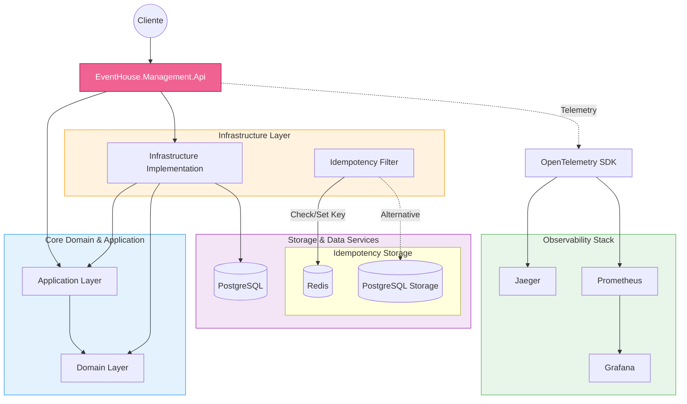

# 🎟️ EventHouse Management API

<p align="center">
  
  
  
  
</p>

<p align="center">
  <b>Cloud-Native • Clean Architecture • Observability-First • Production-Ready</b>
</p>

---

## 📖 Overview

**EventHouse Management API** is a modern backend system built with **.NET 8**, applying **DDD**, **CQRS**, and **Clean Architecture** principles.

It is designed as a **production-grade portfolio project**, showcasing scalability, observability, and modern cloud-native engineering practices.

---

## ✨ Key Features

| Category | Description |
|----------|-------------|
| 🏗 Architecture | Clean Architecture + DDD + CQRS |
| 🐘 Database | PostgreSQL 16 with EF Core |
| 🧪 Testing | Testcontainers + xUnit + Respawn |
| 📊 Observability | OpenTelemetry + Prometheus + Grafana |
| 🛡 Validation | FluentValidation + RFC 9457 errors |
| 🚀 Dev Experience | Docker-first development |

---

## 🧠 Architecture



---

## 🏗 Tech Stack

- .NET 8
- ASP.NET Core Web API
- PostgreSQL 16
- Entity Framework Core
- MediatR
- FluentValidation
- OpenTelemetry
- Docker & Docker Compose
- xUnit + Testcontainers

---

## 🚀 Getting Started

### 🐳 Run with Docker

```bash
docker-compose up -d --build
```

---

### 💻 Run Locally

```powershell
$Env:Auth__DevSecret="EVENTHOUSE_LOCAL_DEV_SECRET_32_CHARS_MINIMUM!!"
dotnet run --project EventHouse.Management.Api
```

---

## 🗄️ Database

### Create Migration

```bash
dotnet ef migrations add <MigrationName> --project EventHouse.Management.Infrastructure --startup-project EventHouse.Management.Api --output-dir Persistence/Migrations
```

### Update Database

```bash
dotnet ef database update --project EventHouse.Management.Infrastructure --startup-project EventHouse.Management.Api
```

---

## 🧪 Testing Strategy

- Unit Tests → Domain logic validation
- Integration Tests → PostgreSQL via Testcontainers
- Fast resets → Respawn
- Shared fixtures → optimized execution

---

## 📊 Observability

- 🔭 Distributed tracing → OpenTelemetry + Jaeger
- 📈 Metrics → Prometheus + Grafana
- 🩺 Health checks → `/health`
- 🧾 Correlation IDs → `X-Correlation-Id`

---

## 📁 Project Highlights

- PostgreSQL-first migration (from SQLite)
- Snake_case naming strategy
- Microsecond precision handling (`10^-6`)
- Shared test infrastructure project
- High-performance integration testing pipeline

---

## ⚡ Goals

This project demonstrates:

- Senior-level backend architecture
- Cloud-native design principles
- Realistic production testing strategies
- Scalable system design

---

## 📌 License

This project is for educational and portfolio purposes.
