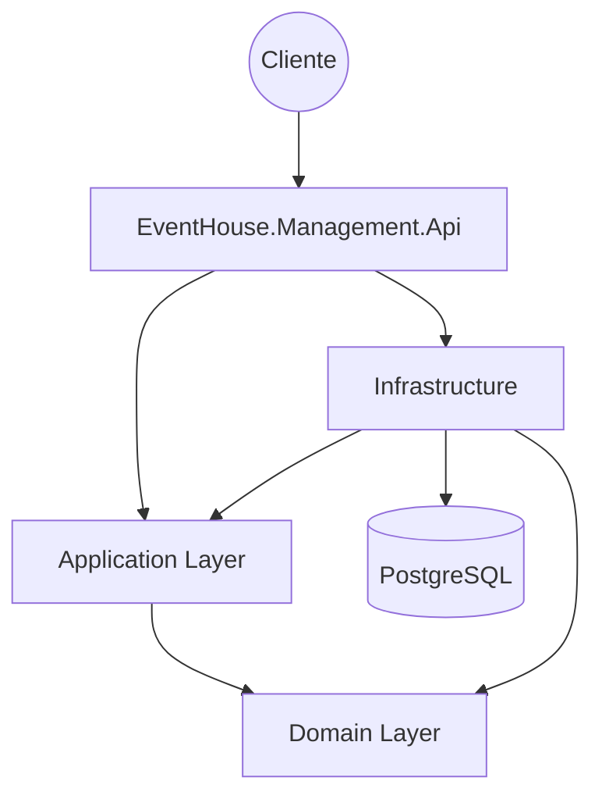

# Architecture

## 🧠 Architecture

```mermaid
graph TD
    Client((Cliente))
    Client --> API[EventHouse.Management.Api]
    API --> Application[Application Layer]
    API --> Infra[Infrastructure]
    Application --> Domain[Domain Layer]
    Infra --> Application
    Infra --> Domain
    Infra --> Postgres[(PostgreSQL)]
```

Clean Architecture layers: Domain, Application, Infrastructure, Api, OpenApi, ShareKernel. MediatR CQRS in Application. Architecture tests enforce layering.
